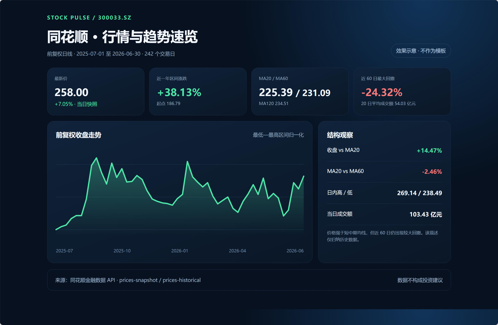

# 单股行情与趋势速览

> 从一只股票出发，把最新行情与近一年趋势放进一张可继续探索的看板。

## 适用场景

第一次使用项目、快速了解某只 A 股近期表现，或为日常复盘建立一个轻量入口。默认示例标的是同花顺（`300033.SZ`），也可以替换为股票名称或代码。

## Prompt 示例

```text
请在当前仓库中制作一张“单股行情与趋势速览”金融看板。先读取 AGENTS.md、skills/financial-api/SKILL.md 和 toolkit/README.md，确认当前能力后再取数。输入标的默认为“同花顺”，先通过 toolkit/fuyao 的 tickers-search 消歧为唯一 thscode，再调用 prices-snapshot 获取最新行情，并调用 prices-historical 获取最近约 250 个交易日的前复权日 K。计算区间涨跌幅、20/60/120 日均线、近 60 日最大回撤和成交额变化，生成一个可直接打开的单文件 HTML，保存到 out/inspirations/stock-overview.html。页面如何布局、配色和选择图表由你决定，但必须展示数据源、标的代码、行情时间、复权口径和非投资建议声明。不要读取或模仿 examples/inspirations 下的示例截图和 example.html；它们不是模板。不得使用模拟数据；如果某项数据不可用，在页面中说明原因。原始响应写入 out/inspirations-data/，不要把长序列输出到对话中，也不要把 API Key 写入任何文件。
```

## 效果预览

下图只展示一种可能效果，不是页面模板或复现标准。



[打开示例静态 HTML](example.html)

## 能力与口径

- 路径：`tickers-search`、`prices-snapshot`、`prices-historical`。
- 范围：单只 A 股、约 250 个交易日、日线前复权。
- 前置条件：设置 `FUYAO_TOKEN` 或 `API_KEY`。
