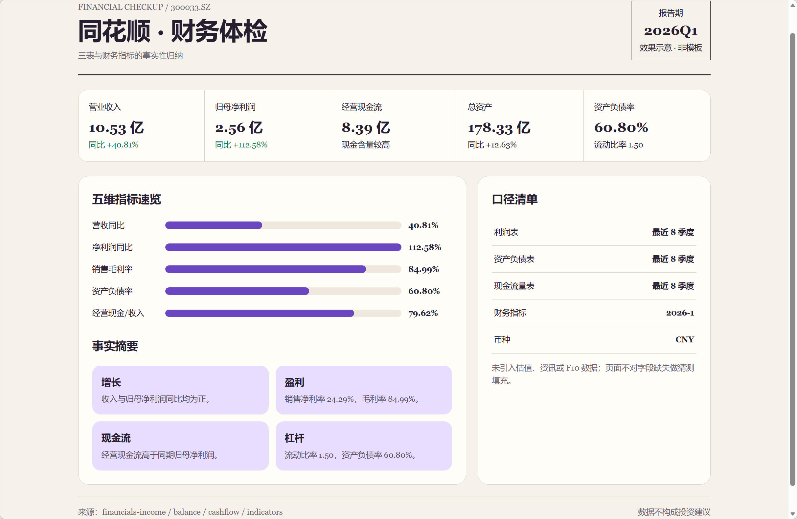
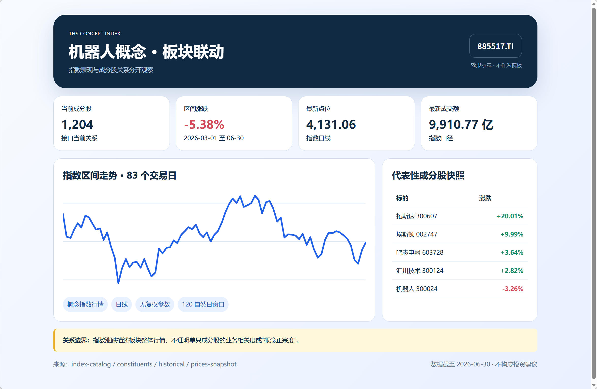
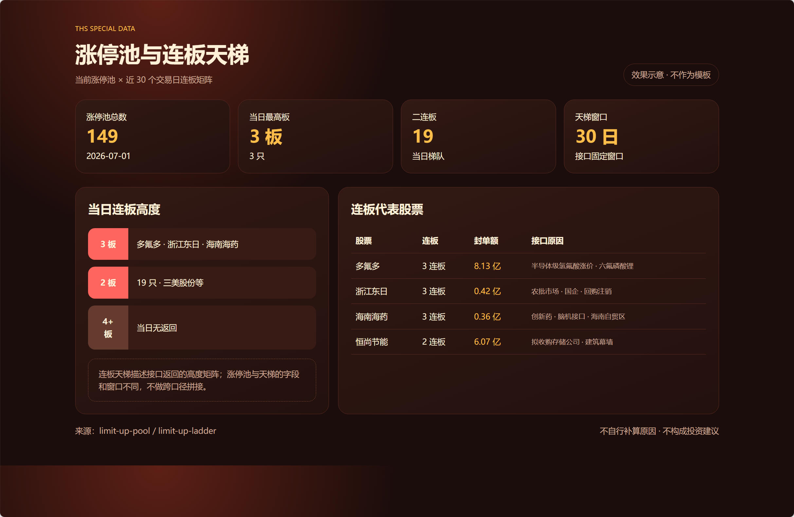
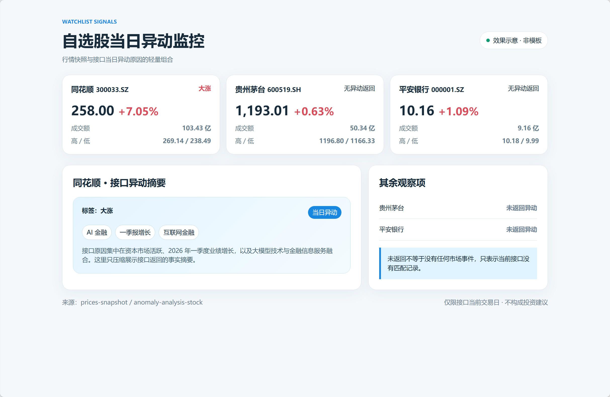
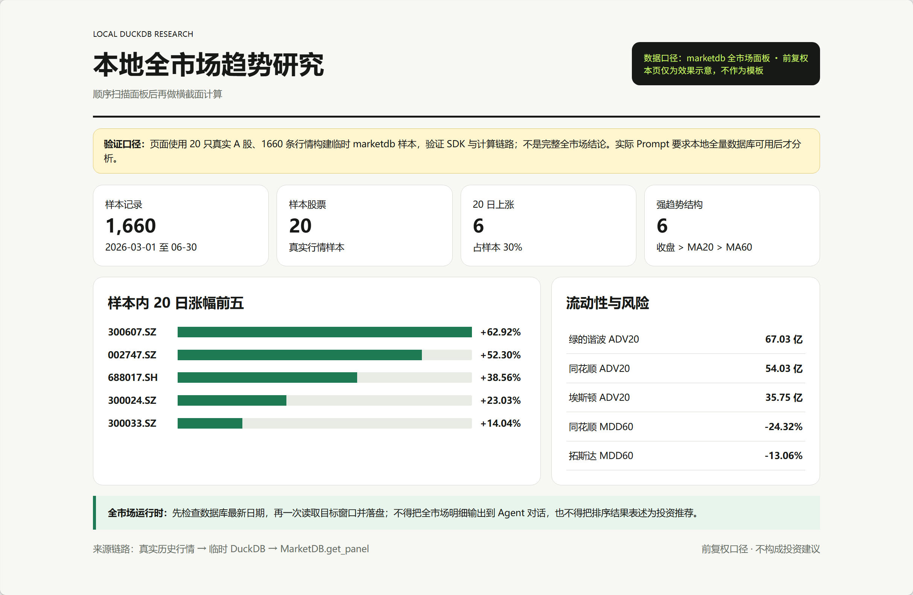

# 灵感

复制一段 Prompt，调用本项目已有数据能力，制作你的第一张金融看板。

截图和静态 HTML 只展示一种可能效果，不是模板或复现标准。可在本页展开并复制 Prompt 交给 Agent，让它自由设计页面。

<!-- INSPIRATIONS:START -->
## 1. 单股行情与趋势速览

<table>
<tr>
<td width="440" valign="top">

</td>
<td valign="top">

从一只股票出发，把最新行情与近一年趋势放进一张可继续探索的看板。

<a href="01-stock-overview/README.md">查看完整说明</a> · <a href="01-stock-overview/example.html">打开静态 HTML</a>

<strong>复制 Prompt</strong>

<pre><code>请在当前仓库中制作一张“单股行情与趋势速览”金融看板。先读取 AGENTS.md、skills/financial-api/SKILL.md 和 toolkit/README.md，确认当前能力后再取数。输入标的默认为“同花顺”，先通过 toolkit/fuyao 的 tickers-search 消歧为唯一 thscode，再调用 prices-snapshot 获取最新行情，并调用 prices-historical 获取最近约 250 个交易日的前复权日 K。计算区间涨跌幅、20/60/120 日均线、近 60 日最大回撤和成交额变化，生成一个可直接打开的单文件 HTML，保存到 out/inspirations/stock-overview.html。页面如何布局、配色和选择图表由你决定，但必须展示数据源、标的代码、行情时间、复权口径和非投资建议声明。不要读取或模仿 examples/inspirations 下的示例截图和 example.html；它们不是模板。不得使用模拟数据；如果某项数据不可用，在页面中说明原因。原始响应写入 out/inspirations-data/，不要把长序列输出到对话中，也不要把 API Key 写入任何文件。</code></pre>

</td>
</tr>
</table>

## 2. 单股财务体检

<table>
<tr>
<td width="440" valign="top">

</td>
<td valign="top">

将利润表、资产负债表、现金流量表和财务指标组织成事实清晰的公司体检页。

<a href="02-financial-health/README.md">查看完整说明</a> · <a href="02-financial-health/example.html">打开静态 HTML</a>

<strong>复制 Prompt</strong>

<pre><code>请在当前仓库中制作一张“单股财务体检”金融看板。先读取 AGENTS.md、skills/financial-api/SKILL.md 和 toolkit/README.md，并只使用当前 toolkit 已暴露能力。输入标的默认为“同花顺”，先用 tickers-search 确认唯一 thscode；通过 toolkit/fuyao 分别获取最近 8 期季度利润表、资产负债表、现金流量表，并根据最新已披露报告期调用 financials-indicators。围绕增长、盈利、现金流、杠杆四个维度做事实性分析，至少展示营业收入、归母净利润、经营活动现金流、总资产、总负债以及接口提供的关键财务指标；字段缺失时保持空缺并说明，不自行推算不同口径字段。生成可直接打开的单文件 HTML，保存到 out/inspirations/financial-health.html。视觉方案和图表形式由你自由设计，但需标注报告期、数据源、字段口径和非投资建议声明。不要读取或模仿 examples/inspirations 下的截图和示例 HTML。不得使用模拟数据，不补充项目当前未提供的估值、资讯或 F10 数据；原始响应落盘，不要在对话中输出完整财务记录，也不要将 API Key 写入文件。</code></pre>

</td>
</tr>
</table>

## 3. 同花顺概念板块联动

<table>
<tr>
<td width="440" valign="top">

</td>
<td valign="top">

将同花顺概念指数、区间行情和当前成分股放在一起观察板块整体表现。

<a href="03-index-constituents/README.md">查看完整说明</a> · <a href="03-index-constituents/example.html">打开静态 HTML</a>

<strong>复制 Prompt</strong>

<pre><code>请在当前仓库中制作一张“同花顺概念板块联动”金融看板。先读取 AGENTS.md、skills/financial-api/SKILL.md 和 toolkit/README.md，并遵守大数据结果落盘规则。输入概念默认为“机器人”；调用 toolkit/fuyao 的 index-catalog --tag cn_concept，把完整目录保存到 out/inspirations-data/ 后在本地筛选名称，若有多个候选先列出候选并选择名称最匹配的一项，同时在页面标明选择结果。随后调用 index-constituents 获取当前成分股，调用 index-historical 获取最近约 120 个自然日的日线行情；只对少量代表性成分股调用 prices-snapshot，不能把全量成分股逐只请求。计算指数区间涨跌幅、近 20 日波动、成交额变化和成分股数量，生成可直接打开的单文件 HTML 到 out/inspirations/index-constituents.html。页面设计由你自由发挥，但板块股票池关系与指数行情必须分开展示，并提示指数涨跌不能证明单只股票的概念相关度。不要读取或模仿 examples/inspirations 中的示例资产，不使用模拟数据，不引入当前 toolkit 未提供的公司画像或资讯；保留指数代码、数据日期、来源和非投资建议声明，不要在对话中粘贴完整目录或成分股列表。</code></pre>

</td>
</tr>
</table>

## 4. 涨停池与连板天梯

<table>
<tr>
<td width="440" valign="top">

</td>
<td valign="top">

用同花顺特色数据观察当日涨停结构与近 30 个交易日的连板高度变化。

<a href="04-limit-up-market/README.md">查看完整说明</a> · <a href="04-limit-up-market/example.html">打开静态 HTML</a>

<strong>复制 Prompt</strong>

<pre><code>请在当前仓库中制作一张“涨停池与连板天梯”金融看板。开始前读取 AGENTS.md、skills/financial-api/SKILL.md 和 toolkit/README.md，只调用当前 toolkit/fuyao 已暴露的 limit-up-pool 与 limit-up-ladder。limit-up-pool 使用服务端当前日期，按连板天数或封单金额排序并限制在合理页大小；limit-up-ladder 使用接口返回的近 30 个交易日矩阵。将原始响应保存到 out/inspirations-data/，计算当日涨停股票数、最高连板、连板层级分布、行业分布和封单额较高的代表股票，再生成可直接打开的单文件 HTML 到 out/inspirations/limit-up-market.html。页面结构和视觉表达由你决定，可以采用天梯、矩阵、榜单或其他合适形式，但必须保留接口返回的交易日期和更新时间，明确“当前涨停池”与“近 30 日连板天梯”的时间范围差异。不要读取或模仿 examples/inspirations 中的示例截图和 HTML，不自行补算涨停原因，不使用模拟数据，不输出买卖建议，也不要在对话中粘贴完整股票池。</code></pre>

</td>
</tr>
</table>

## 5. 自选股当日异动监控

<table>
<tr>
<td width="440" valign="top">

</td>
<td valign="top">

把一组自选股的实时行情和同花顺当日异动原因合并成轻量监控页。

<a href="05-watchlist-anomalies/README.md">查看完整说明</a> · <a href="05-watchlist-anomalies/example.html">打开静态 HTML</a>

<strong>复制 Prompt</strong>

<pre><code>请在当前仓库中制作一张“自选股当日异动监控”金融看板。先读取 AGENTS.md、skills/financial-api/SKILL.md 和 toolkit/README.md。输入默认为“同花顺、贵州茅台、平安银行”，使用 tickers-search 逐一消歧并去重，最多保留 20 只 A 股；再用 prices-snapshot 批量获取行情，并用 anomaly-analysis-stock 查询这些代码的当日异动原因。把响应保存到 out/inspirations-data/，按涨跌幅或是否存在异动组织页面，展示最新价、涨跌幅、成交额、异动标签、异动时间和接口原因，生成可直接打开的单文件 HTML 到 out/inspirations/watchlist-anomalies.html。页面布局、配色、交互和图表由你自由设计，但必须明确异动能力仅覆盖接口当前交易日，未返回异动不能解释为股票没有任何市场事件。不要读取或模仿 examples/inspirations 中的示例资产，不扩展到用户未输入股票，不使用模拟数据，不预测未来走势；标注行情时间、数据来源和非投资建议声明，不要将 API Key 写入任何输出。</code></pre>

</td>
</tr>
</table>

## 6. 本地全市场趋势研究

<table>
<tr>
<td width="440" valign="top">

</td>
<td valign="top">

用 marketdb 的本地全市场面板构建可复用的趋势与流动性研究视图。

<a href="06-marketdb-research/README.md">查看完整说明</a> · <a href="06-marketdb-research/example.html">打开静态 HTML</a>

<strong>复制 Prompt</strong>

<pre><code>请在当前仓库中制作一张“本地全市场趋势研究”金融看板。先读取 AGENTS.md、skills/financial-api/SKILL.md、toolkit/README.md 和 toolkit/marketdb/README.md。先运行 marketdb status/describe 确认 data/market.duckdb 的最新日期和可用视图；数据库不存在或数据过旧时停止并给出 python bootstrap.py / marketdb auto-sync 指引，不要静默改用全市场远端逐股请求。数据库可用时，通过 MarketDB.get_panel 或等价 SQL 一次读取最近约 80 个交易日的前复权全市场面板，把明细保存到 out/inspirations-data/，计算每只股票的 20 日涨跌幅、20 日平均成交额、60 日最大回撤和均线结构，再按明确规则汇总市场上涨占比、强趋势数量、流动性分层和代表股票。生成可直接打开的单文件 HTML 到 out/inspirations/marketdb-research.html。页面和图表可以自由设计，但必须显示数据库最新日期、样本数、过滤规则、复权口径和非投资建议声明。不要读取或模仿 examples/inspirations 中的截图和示例 HTML，不使用模拟数据，不把全市场明细输出到对话，也不要把筛选结果表述为投资推荐。</code></pre>

</td>
</tr>
</table>
<!-- INSPIRATIONS:END -->
